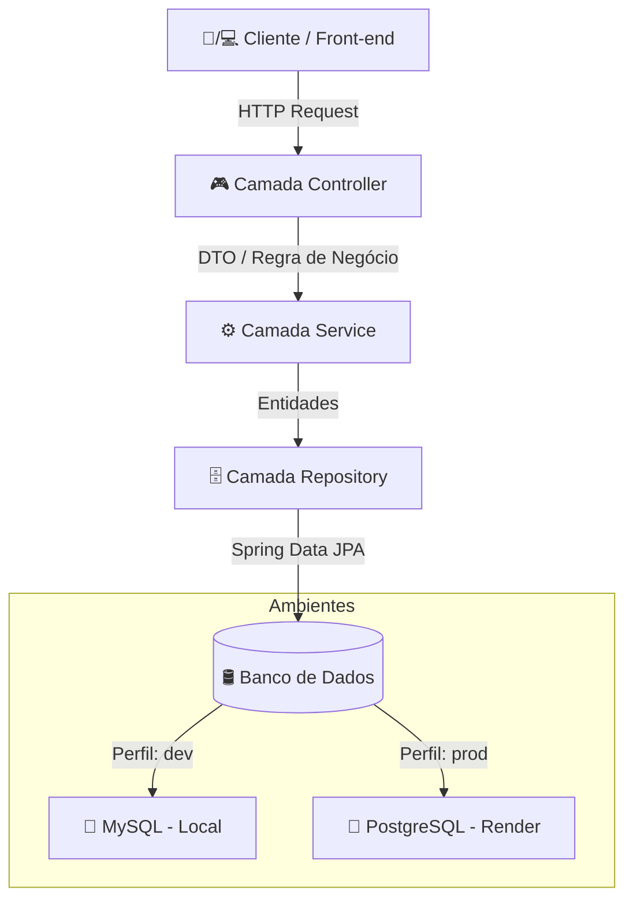

 Blog Pessoal - API RESTful

<p align="center">
  
  
  
  
  
  
</p>

---

## 🌐 Link do Deploy

> 🚀 **API Rodando em Produção:**  
> [https://blog-pessoal-k3fp.onrender.com](https://blog-pessoal-k3fp.onrender.com)

---

## 🎯 Sobre o Projeto

O **Blog Pessoal** é uma API RESTful desenvolvida com **Spring Boot** para gerenciamento de postagens, temas e usuários. O sistema foi projetado seguindo a arquitetura em camadas, aplicando as melhores práticas de desenvolvimento backend em Java, suporte a múltiplos ambientes (Desenvolvimento com MySQL e Produção com PostgreSQL) e documentação interativa com Swagger.

---

## 📊 Arquitetura e Fluxo de Dados



---

## 📋 Endpoints e Funcionalidades

### 👤 Usuários (`/usuarios`)

| Método | Endpoint | Descrição |
| :--- | :--- | :--- |
| `GET` | `/usuarios/all` | Lista todos os usuários cadastrados |
| `GET` | `/usuarios/{id}` | Busca usuário por ID |
| `POST` | `/usuarios/cadastrar` | Cadastra um novo usuário |
| `PUT` | `/usuarios/atualizar` | Atualiza os dados de um usuário |
| `POST` | `/usuarios/logar` | Autentica o usuário |

### 🏷️ Temas (`/temas`)

| Método | Endpoint | Descrição |
| :--- | :--- | :--- |
| `GET` | `/temas` | Lista todos os temas |
| `GET` | `/temas/{id}` | Busca tema por ID |
| `GET` | `/temas/descricao/{descricao}` | Busca temas por descrição |
| `POST` | `/temas` | Cria um novo tema |
| `PUT` | `/temas` | Atualiza um tema existente |
| `DELETE` | `/temas/{id}` | Deleta um tema por ID |

### 📝 Postagens (`/postagens`)

| Método | Endpoint | Descrição |
| :--- | :--- | :--- |
| `GET` | `/postagens` | Lista todas as postagens |
| `GET` | `/postagens/{id}` | Busca postagem por ID |
| `GET` | `/postagens/titulo/{titulo}` | Busca postagens por título |
| `POST` | `/postagens` | Cria uma nova postagem |
| `PUT` | `/postagens` | Atualiza uma postagem existente |
| `DELETE` | `/postagens/{id}` | Deleta uma postagem por ID |

---

## 🛠️ Tecnologias Utilizadas

| Categoria | Tecnologia |
| :--- | :--- |
| **Linguagem** | Java 17 |
| **Framework** | Spring Boot 3 |
| **Persistência / ORM** | Spring Data JPA / Hibernate |
| **Bancos de Dados** | MySQL (Dev) / PostgreSQL (Prod) |
| **Documentação** | Springdoc OpenAPI (Swagger UI) |
| **Hospedagem** | Render |

---

## ⚙️ Configuração de Ambientes (Profiles)

### `application.properties` (Principal)

```properties
spring.profiles.active=prod
spring.jpa.open-in-view=true
```

### `application-dev.properties` (Desenvolvimento Local - MySQL)

```properties
spring.datasource.url=jdbc:mysql://localhost:3306/db_blogpessoal?createDatabaseIfNotExist=true&serverTimezone=UTC
spring.datasource.username=root
spring.datasource.password=root
spring.jpa.hibernate.ddl-auto=update
spring.jpa.database-platform=org.hibernate.dialect.MySQLDialect
```

### `application-prod.properties` (Produção - PostgreSQL)

```properties
spring.datasource.url=jdbc:postgresql://${POSTGRESHOST}:5432/${POSTGRESDATABASE}?sslmode=require
spring.datasource.username=${POSTGRESUSER}
spring.datasource.password=${POSTGRESPASSWORD}
spring.jpa.hibernate.ddl-auto=update
spring.datasource.driver-class-name=org.postgresql.Driver
```

---

## 🚀 Como Executar o Projeto Localmente

1. **Clone o repositório:**
   ```bash
   git clone https://github.com/vitoriaalbuquerqueee/Blog-Pessoal.git
   cd Blog-Pessoal
   ```

2. **Configure o perfil local:**
   Altere a propriedade em `src/main/resources/application.properties` para:
   ```properties
   spring.profiles.active=dev
   ```

3. **Execute a aplicação:**
   ```bash
   ./mvnw spring-boot:run
   ```

4. **Acesse a documentação no navegador:**
   ```text
   http://localhost:8080/swagger-ui/index.html
   ```
        DB -->|Perfil: prod| Postgres[🐘 PostgreSQL - Render]
    end
